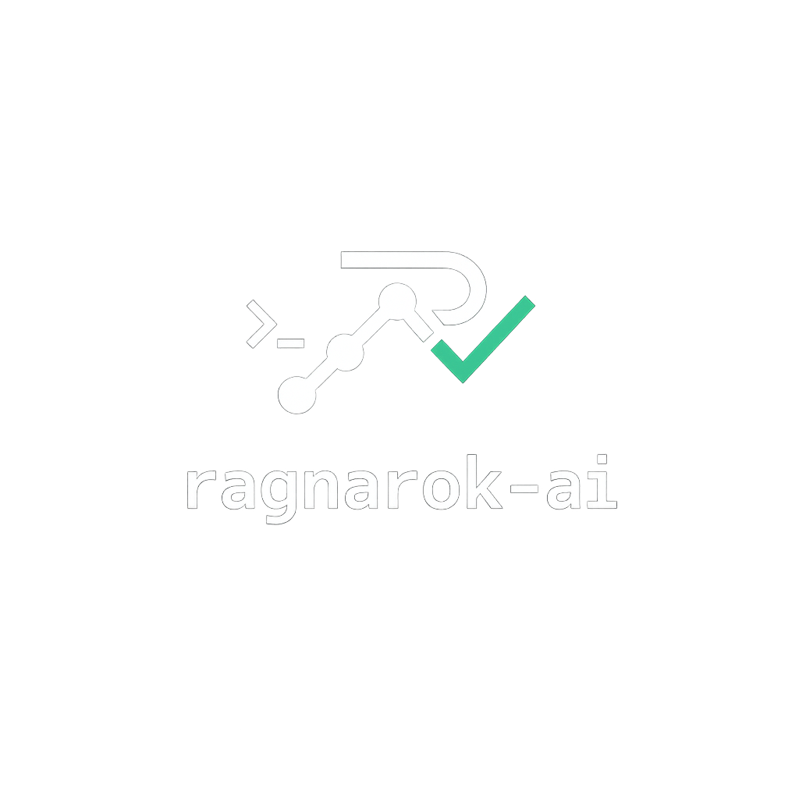
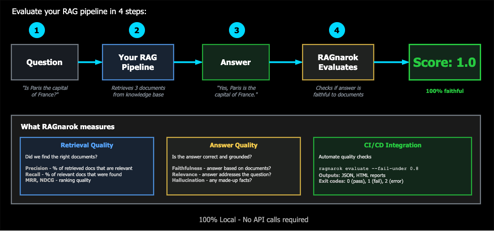
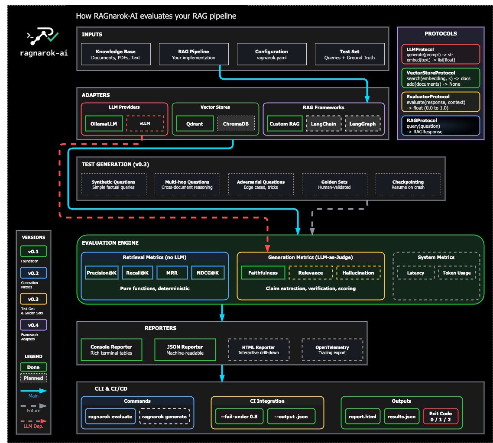

<p align="center">
  
</p>

<p align="center">
  <strong>Local-first RAG evaluation framework for LLM applications</strong>
</p>

<p align="center">
  Evaluate, benchmark, and monitor your RAG pipelines — 100% locally, no API keys required.
</p>

<p align="center">
  <a href="https://github.com/2501Pr0ject/RAGnarok-AI/actions/workflows/ci.yml"></a>
  <a href="https://www.python.org/downloads/"></a>
  <a href="https://www.gnu.org/licenses/agpl-3.0"></a>
  <a href="https://github.com/astral-sh/ruff"></a>
  <a href="https://mypy-lang.org/"></a>
</p>

<p align="center">
  <a href="#-the-problem">Problem</a> •
  <a href="#-the-solution">Solution</a> •
  <a href="#-quick-start">Quick Start</a> •
  <a href="#-installation">Installation</a> •
  <a href="#-roadmap">Roadmap</a>
</p>

---

## The Problem

Building RAG systems is easy. **Knowing if they actually work is hard.**

Current evaluation tools are either:

| Tool | Issue |
|------|-------|
| **Giskard** | Heavy, slow (45-60 min scans), loses progress on crash, enterprise-focused |
| **RAGAS** | Requires OpenAI API keys, no local-first option |
| **Manual testing** | Doesn't scale, not reproducible |

**You need a tool that:**
- ✅ Runs 100% locally (Ollama, local models)
- ✅ Evaluates fast with checkpointing (no lost progress)
- ✅ Integrates with your existing stack (LangChain, LangGraph)
- ✅ Fits in CI/CD pipelines
- ✅ Doesn't require a PhD to use

---

## The Solution

**ragnarok-ai** is a lightweight, local-first framework to evaluate RAG pipelines.

<p align="center">
  
</p>

```python
from ragnarok_ai import evaluate, generate_testset

# Generate test questions from your knowledge base
testset = await generate_testset(
    knowledge_base="./docs/",
    num_questions=50,
    types=["simple", "multi_hop", "adversarial"],
    llm="ollama/mistral",
    checkpoint=True,  # Resume if interrupted
)

# Evaluate your RAG pipeline
results = await evaluate(
    rag_pipeline=my_rag,
    testset=testset,
    metrics=["retrieval", "faithfulness", "relevance"],
    llm="ollama/mistral",
)

# Get actionable insights
results.summary()
# ┌─────────────────┬───────┬────────┐
# │ Metric          │ Score │ Status │
# ├─────────────────┼───────┼────────┤
# │ Retrieval P@10  │ 0.82  │ ✅      │
# │ Faithfulness    │ 0.74  │ ⚠️      │
# │ Relevance       │ 0.89  │ ✅      │
# │ Hallucination   │ 0.12  │ ✅      │
# └─────────────────┴───────┴────────┘

results.export("report.html")
```

> **Note:** This is the target API for v1.0. See the [Roadmap](#-roadmap) for current implementation status.

---

## Key Features

| Feature | Description |
|---------|-------------|
| **100% Local** | Runs entirely on your machine with Ollama. No OpenAI, no API keys, no data leaving your network. |
| **Fast & Resilient** | Built-in checkpointing — crash mid-evaluation? Resume exactly where you left off. |
| **Framework Agnostic** | Works with LangChain, LangGraph, LlamaIndex, or your custom RAG. |
| **Comprehensive Metrics** | Retrieval quality, faithfulness, relevance, hallucination detection, latency tracking. |
| **Test Generation** | Auto-generate diverse test sets from your knowledge base. |
| **CI/CD Ready** | CLI-first design, JSON output, exit codes for pipeline integration. |
| **Lightweight** | Minimal dependencies. No torch/transformers in core. |

---

## Comparison

| Feature | ragnarok-ai | Giskard | RAGAS |
|---------|-------------|---------|-------|
| 100% Local | ✅ | ⚠️ Partial | ❌ |
| Checkpointing | ✅ | ❌ | ❌ |
| Fast evaluation | ✅ | ❌ (45-60 min) | ✅ |
| CLI support | ✅ | ❌ | ❌ |
| LangChain integration | ✅ | ✅ | ✅ |
| Minimal deps | ✅ | ❌ | ⚠️ |
| Free & OSS | ✅ AGPL-3.0 | ⚠️ Open-core | ✅ Apache-2.0 |

---

## Quick Start

### Prerequisites

- Python 3.10+
- [Ollama](https://ollama.ai/) running locally
- [uv](https://github.com/astral-sh/uv) (recommended) or pip

### Install

```bash
# Clone
git clone https://github.com/2501Pr0ject/ragnarok-ai.git
cd ragnarok-ai

# Install with uv
uv venv && source .venv/bin/activate
uv pip install -e ".[ollama,qdrant]"
```

### Run your first evaluation

```bash
# CLI (coming soon)
ragnarok evaluate --rag ./my_rag.py --docs ./knowledge_base/ --output report.html

# Or in Python
python examples/basic_evaluation.py
```

---

## Installation

### Using uv (recommended)

```bash
uv venv
source .venv/bin/activate  # Linux/macOS
uv pip install -e "."
```

### Optional dependencies

```bash
# LLM providers
uv pip install -e ".[ollama]"      # Ollama support

# Vector stores  
uv pip install -e ".[qdrant]"      # Qdrant support

# RAG frameworks
uv pip install -e ".[langchain]"   # LangChain/LangGraph support

# Observability
uv pip install -e ".[telemetry]"   # OpenTelemetry tracing

# Everything
uv pip install -e ".[all]"

# Development
uv pip install -e ".[dev]"
pre-commit install
```

---

## Use Cases

### Continuous RAG Testing in CI/CD

```yaml
# .github/workflows/rag-tests.yml
- name: Evaluate RAG Quality
  run: |
    ragnarok evaluate \
      --config ragnarok.yaml \
      --fail-under 0.8 \
      --output results.json
```

### Compare Embedding Models

```python
configs = [
    {"embedder": "nomic-embed-text", "chunk_size": 512},
    {"embedder": "mxbai-embed-large", "chunk_size": 256},
]

results = await benchmark(
    rag_factory=create_rag,
    configs=configs,
    testset=testset,
)
results.compare()  # Side-by-side comparison
```

### Monitor Production Quality

```python
# Track quality drift over time
metrics = await evaluate(rag, production_queries)
metrics.log_to("./metrics/")  # Time-series storage
```

---

## Metrics

### Retrieval Metrics
- **Precision@K** — Relevant docs in top K results
- **Recall@K** — Coverage of relevant docs
- **MRR** — Mean Reciprocal Rank
- **NDCG** — Normalized Discounted Cumulative Gain

### Generation Metrics
- **Faithfulness** — Is the answer grounded in retrieved context?
- **Relevance** — Does the answer address the question?
- **Hallucination** — Does the answer contain fabricated info?
- **Completeness** — Are all aspects of the question covered?

### System Metrics
- **Latency** — End-to-end response time
- **Token usage** — Cost tracking for LLM calls

---

## Roadmap

### Completed

<details>
<summary><strong>v0.1 — Foundation</strong></summary>

- [x] Project setup & architecture
- [x] Core retrieval metrics (precision, recall, MRR, NDCG)
- [x] Ollama adapter
- [x] Console reporter
- [x] JSON reporter
- [x] Basic CLI
- [x] CI/CD with GitHub Actions

</details>

<details>
<summary><strong>v0.2 — Generation Metrics & Reporting</strong></summary>

- [x] Qdrant adapter
- [x] Faithfulness evaluator
- [x] Relevance evaluator
- [x] Hallucination detection
- [x] HTML report with drill-down (failed questions, retrieved chunks)
- [x] Intelligent CI gating (stable metrics fail, LLM judgments warn)

</details>

<details>
<summary><strong>v0.3 — Test Generation & Golden Sets</strong></summary>

- [x] Synthetic question generation
- [x] Multi-hop question support
- [x] Adversarial question generation
- [x] Checkpointing system
- [x] Golden set support (human-validated, versioned question sets)
- [x] Baselines library (configs + expected results)
- [x] NovaTech example dataset for quickstart

</details>

<details>
<summary><strong>v0.4 — Framework Adapters & Observability</strong></summary>

- [x] LangChain integration
- [x] LangGraph integration
- [x] Custom RAG protocol support
- [x] OpenTelemetry export for tracing & debugging

</details>

<details>
<summary><strong>v0.5 — Performance & Scale</strong></summary>

- [x] Async parallelization (`max_concurrency` parameter)
- [x] Result caching (`MemoryCache`, `DiskCache`, `CacheProtocol`)
- [x] Batch processing (`BatchEvaluator` for 1000+ queries)
- [x] Progress callbacks (sync and async support)
- [x] Timeout and retry (`timeout`, `max_retries`, `retry_delay`)
- [x] Cache error handling (graceful degradation)

</details>

<details>
<summary><strong>v0.6 — Cloud & Local Adapters</strong></summary>

- [x] vLLM adapter (local high-performance inference)
- [x] OpenAI adapter (optional cloud fallback)
- [x] Anthropic adapter
- [x] ChromaDB adapter
- [x] FAISS adapter (pure local, no server)

</details>

### Planned

#### v0.7 — Framework Adapters
- [ ] LlamaIndex adapter
- [ ] DSPy adapter
- [ ] Adapter contribution guide

#### v0.8 — Comparison & Regression
- [ ] Comparison mode (side-by-side config comparison)
- [ ] Regression detection (alert on quality drop)
- [ ] Benchmark history tracking

#### v0.9 — Agent Evaluation
- [ ] Agent evaluation protocol
- [ ] Tool-use correctness metrics
- [ ] Multi-step reasoning evaluation
- [ ] ReAct pattern support
- [ ] Trajectory analysis

#### v1.0 — Production Ready
- [ ] PyPI publish (`pip install ragnarok-ai`)
- [ ] Stable public API (no breaking changes)
- [ ] Comprehensive documentation site
- [ ] Performance benchmarks published
- [ ] Production monitoring mode

### Future (Post v1.0)

<details>
<summary><strong>Web UI</strong></summary>

- [ ] Basic Web UI (read-only dashboard)
- [ ] Full Web UI dashboard

</details>

<details>
<summary><strong>Plugin Architecture</strong></summary>

- [ ] Plugin architecture for community adapters
- [ ] Entry points system

</details>

<details>
<summary><strong>Developer Experience</strong></summary>

- [ ] GitHub Action (`uses: ragnarok-ai/evaluate@v1`)
- [ ] VS Code extension
- [ ] Jupyter notebook integration
- [ ] Interactive CLI (TUI)
- [ ] Rust acceleration for hot paths

</details>

<details>
<summary><strong>More Integrations</strong></summary>

- [ ] Haystack adapter
- [ ] Semantic Kernel adapter
- [ ] Groq adapter
- [ ] Mistral API adapter
- [ ] Together AI adapter
- [ ] pgvector adapter
- [ ] Weaviate adapter
- [ ] Pinecone adapter
- [ ] Milvus adapter

</details>

<details>
<summary><strong>Advanced Features</strong></summary>

- [ ] Streaming evaluation
- [ ] Cost tracking ($ per evaluation)
- [ ] A/B testing support
- [ ] Dataset versioning
- [ ] Fine-tuning recommendations
- [ ] Multi-modal evaluation (images, audio)

</details>

<details>
<summary><strong>Enterprise</strong></summary>

- [ ] SSO support
- [ ] Role-based access control
- [ ] Audit logging
- [ ] RAGnarok Cloud (managed service)

</details>

---

## Architecture

<p align="center">
  
</p>

<details>
<summary><strong>View project structure</strong></summary>

```
ragnarok-ai/
├── src/ragnarok_ai/
│   ├── core/           # Types, protocols, exceptions
│   ├── evaluators/     # Metric implementations
│   ├── generators/     # Test set generation
│   ├── adapters/       # LLM, vector store, framework adapters
│   ├── reporters/      # Output formatters (JSON, HTML, console)
│   └── cli/            # Command-line interface
├── tests/              # Test suite (pytest)
├── examples/           # Usage examples
├── benchmarks/         # Performance benchmarks
└── docs/               # Documentation
```

</details>

---

## Development

```bash
# Setup
uv pip install -e ".[dev]"
pre-commit install

# Run checks
pytest                    # Tests
pytest --cov=ragnarok_ai  # With coverage
ruff check . --fix        # Lint
ruff format .             # Format  
mypy src/                 # Type check
```

---

## Contributing

Contributions are welcome! Please read [CONTRIBUTING.md](CONTRIBUTING.md) for guidelines.

**Priority areas for contributions:**
- LLM adapters (vLLM, OpenAI, Anthropic)
- Vector store adapters (ChromaDB, FAISS, pgvector)
- Framework adapters (LlamaIndex, DSPy, Haystack)
- Documentation & examples
- Performance optimizations

---

## License

This project is licensed under the [AGPL-3.0 License](LICENSE).

**Why AGPL?** To ensure improvements stay open-source and prevent the "open-core bait-and-switch" model where companies take OSS code and monetize without contributing back.

---

## Acknowledgments

Built out of frustration with complex evaluation setups. We wanted something that just works — locally, fast, and without API keys.

---

<p align="center">
  <sub>Built with ❤️ in Lyon, France</sub>
</p>
